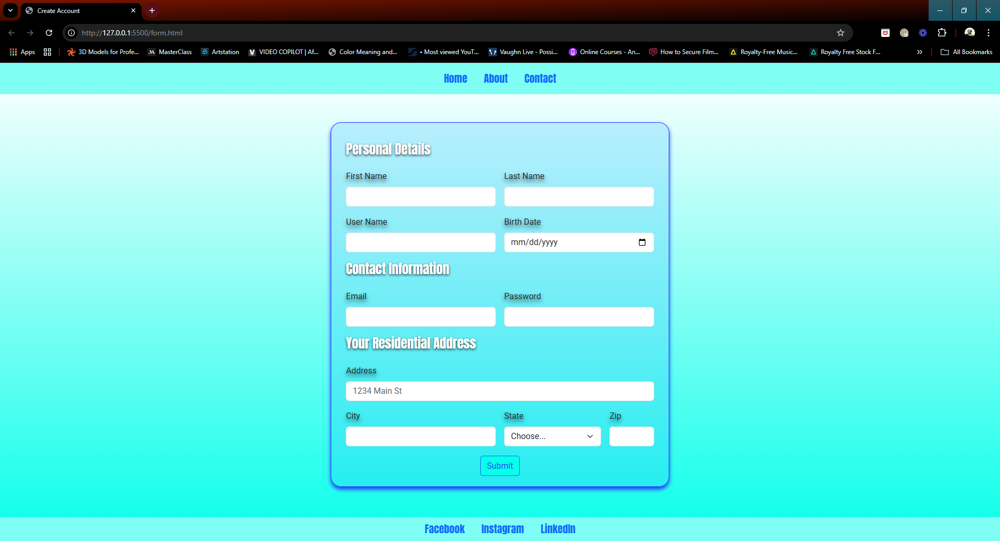

# Create Account Form

A responsive and aesthetically pleasing form for creating a user account. This project is styled with a mix of **custom CSS** and **Bootstrap 5.3**, and includes distinct sections for personal details, contact information, and residential address.



---

## Table of Contents
- [Create Account Form](#create-account-form)
  - [Table of Contents](#table-of-contents)
  - [Features](#features)
  - [Technologies Used](#technologies-used)
  - [Project Structure](#project-structure)

---

## Features
- **Responsive Layout**: Built with CSS Grid and Bootstrap for modern, flexible design.
- **Styled UI Components**: Form fields, buttons, and headers styled with custom CSS for a sleek look.
- **Sectioned Form Design**:
  - Personal Details
  - Contact Information
  - Residential Address
- **Google Fonts Integration**: Includes **Anton** and **Roboto** for clean typography.
- **Interactive Submit Button**: Styled with Bootstrap for consistency.

---

## Technologies Used
- **HTML5**: Provides the structure for the form and page layout.
- **CSS3**: Custom styling and grid-based layout.
- **Bootstrap 5.3**: Used for responsive elements and form controls.
- **Google Fonts**: Adds professional font styling.

---

## Project Structure
```
project-folder/
├── img/
│   └── Render.PNG
├── form_stylesheet.css
├── form.html
```